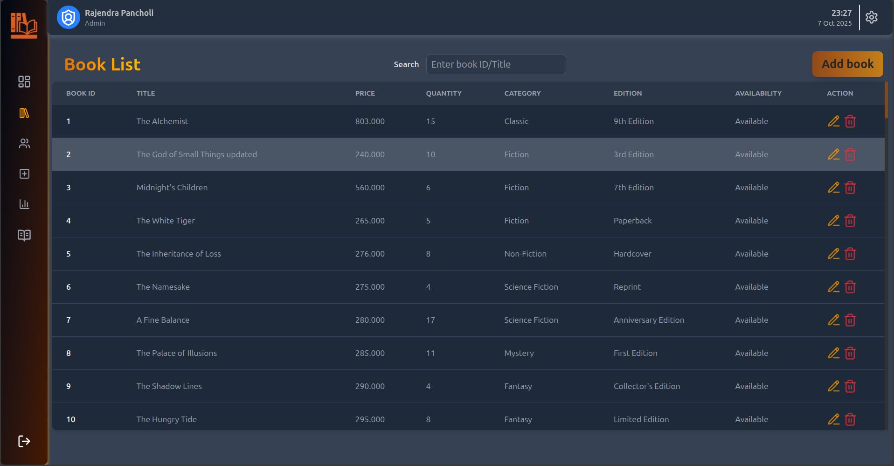
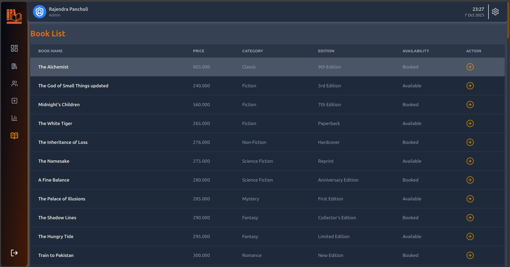
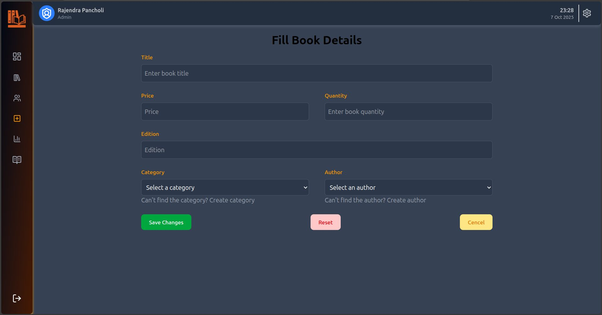

<h1 align="center">
  <a href="https://rajebookbary.vercel.app"></a>
  <br>
  <p>BookBary Library Management System</p>
</h1>


<p align="center">
<a href="https://opensource.org/licenses/MIT"></a>
<a href="https://rajebookbary.vercel.app"></a>
<a href="https://rajebookbary.vercel.app/about"></a>
<a href="https://rajebookbary.vercel.app/about"></a>
<a href="https://rajebookbary.vercel.app/about"></a>
<a href="https://rajebookbary.vercel.app/about"></a>
<a href="https://rajebookbary.vercel.app/about"></a>
<a href="https://rajebookbary.vercel.app/about"></a>
<a href="https://rajebookbary.vercel.app/about"></a>
<a href="https://rajebookbary.vercel.app/about"></a>

</p>


<p align="center">
  <a href="#features">Features</a> •
  <a href="#technologies-used">Technologies Used</a> •
  <a href="#installation">Installation</a> •
  <a href="#usage">Usage</a> •
  <a href="#screenshots">Screenshots</a> •
  <a href="#contributing">Contributing</a> •
  <a href="#license">License</a> •
  <a href="#contact">Contact</a>
</p>


---

## 🌟 Overview
**BookBary** is a modern Library Management System built with **React + Vite**, featuring a **powerful admin panel**. The system helps libraries efficiently manage books, members, and transactions, providing a fast, responsive, and user-friendly interface for both administrators and users.

With BookBary, administrators can monitor library activity, track issued and overdue books, and manage members and inventory seamlessly.

---

## Features

### Admin Panel Features
- ✅ Add, edit, or remove books.
- ✅ Manage member profiles.
- ✅ Track book issuance and returns.
- ✅ View overdue books and send notifications *(if integrated)*.
- ✅ Generate reports on library activity.
- ✅ Dashboard with statistics (total books, issued books, active members, etc.).

### User Features (Optional)
- ✅ Search and filter books by title, author, or category.
- ✅ View borrowed books and borrowing history.

---

## Technologies Used
- **Frontend:** React.js + Vite
- **Styling:** Tailwind CSS / CSS / Styled Components
- **Backend:** Node.js + Express
- **Database:** MySQL
- **State Management:** Redux
- **HTTP Requests:** Axios / Fetch API

---

## Installation

1. **Clone the repository**
```bash
git clone https://github.com/rajendrapancholi/bookbary.git
cd bookbary
````

2. **Install dependencies**

```bash
npm install
# or
yarn install
```

3. **Set up environment variables**
   Create a `.env` file at the root with your backend API URL and other secrets:

```env
VITE_API_URL=http://localhost:5000/api
```

4. **Start the development server**

```bash
npm run dev
# or
yarn dev
```

5. Open your browser at `http://localhost:5173`.

---

## Usage

### Admin Panel

1. Log in with admin credentials.
2. Access the dashboard to view statistics (books, members, issued books).
3. Add, edit, or delete books from the inventory.
4. Manage library members.
5. Track book issuance and returns.
6. Generate reports for library activity.

### User Interface

1. Search and filter books.
2. View borrowing history.
3. Request book issuance (if applicable).

---

## Screenshots

### Home page


### Admin Dashboard


### Book Management



### All Books



### Add book


---

## Contributing

We welcome contributions! Follow these steps:

1. Fork the repository.
2. Create a new branch:

```bash
git checkout -b feature-name
```

3. Commit your changes:

```bash
git commit -m "Add some feature"
```

4. Push to the branch:

```bash
git push origin feature-name
```

5. Open a Pull Request.

---

## License

This project is licensed under the **MIT License**. See [LICENSE](LICENSE) for details.

---

## Contact

* **Project Owner:** Rajendra Pancholi
* **Email:** [rpancholi522@gmail.com](mailto:rpancholi522@gmail.com)
* **GitHub:** [https://github.com/rajendrapancholi](https://github.com/rajendrapancholi)
* **LinkedIn:** [https://www.linkedin.com/in/rajendra-pancholi](https://www.linkedin.com/in/rajendra-pancholi-11a3a5286)

